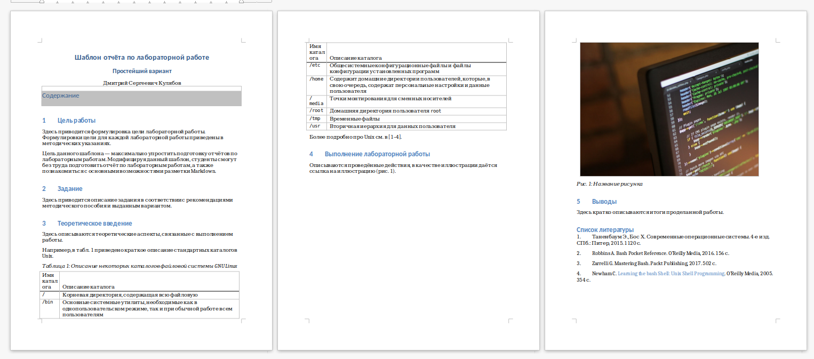
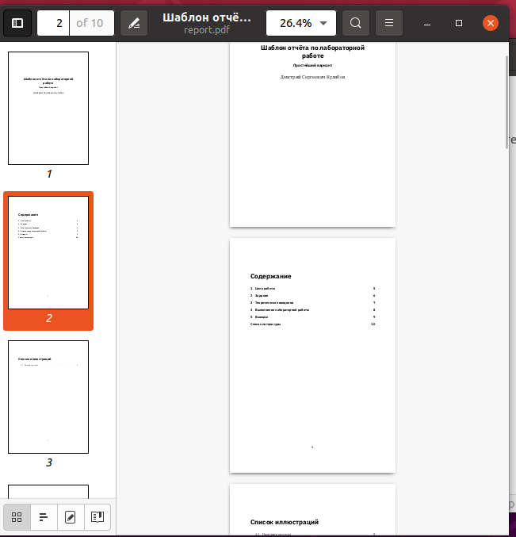
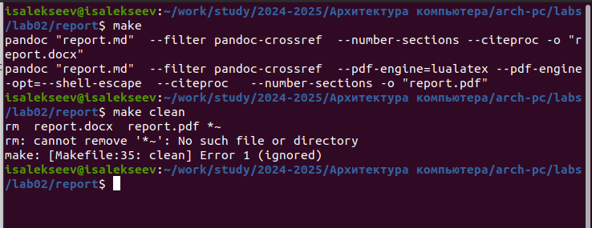
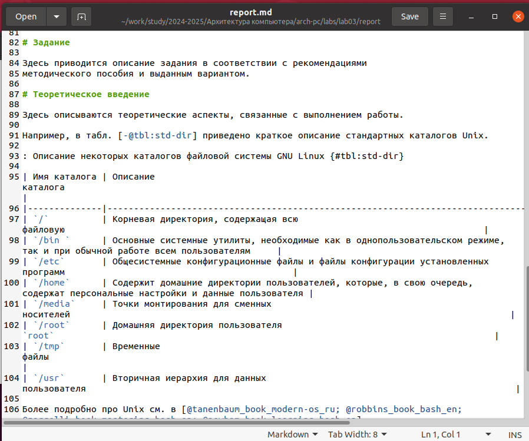
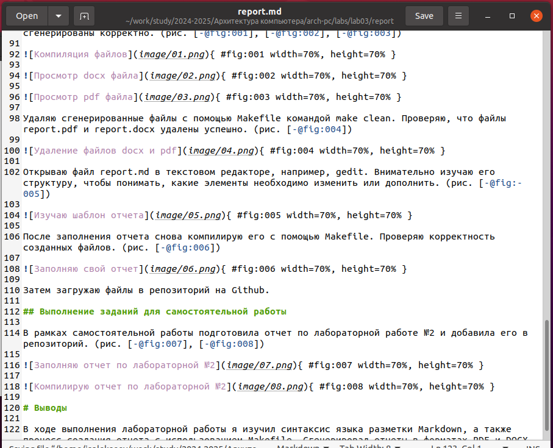
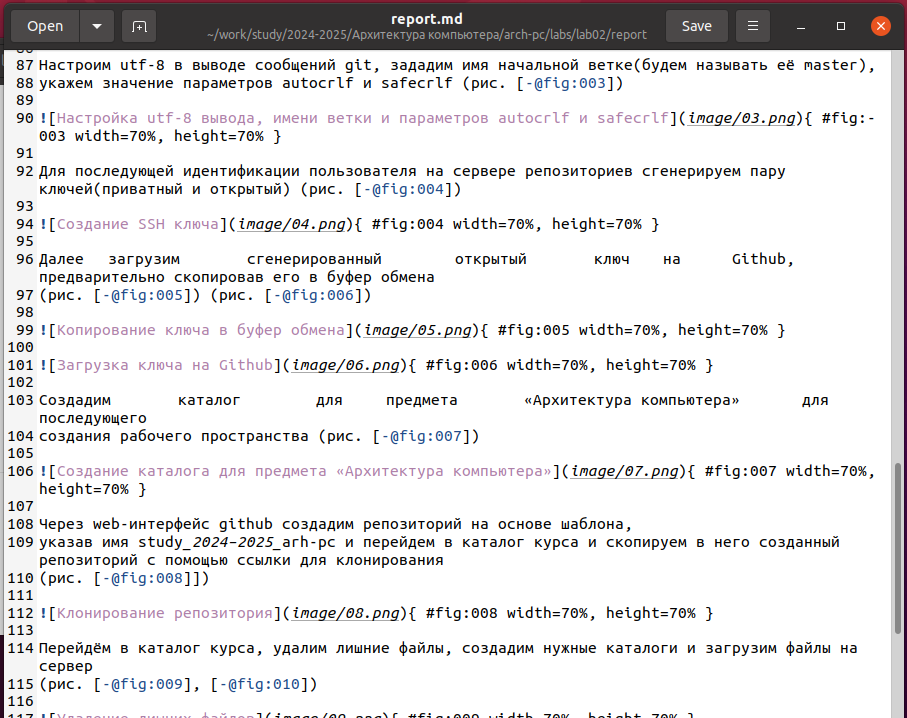
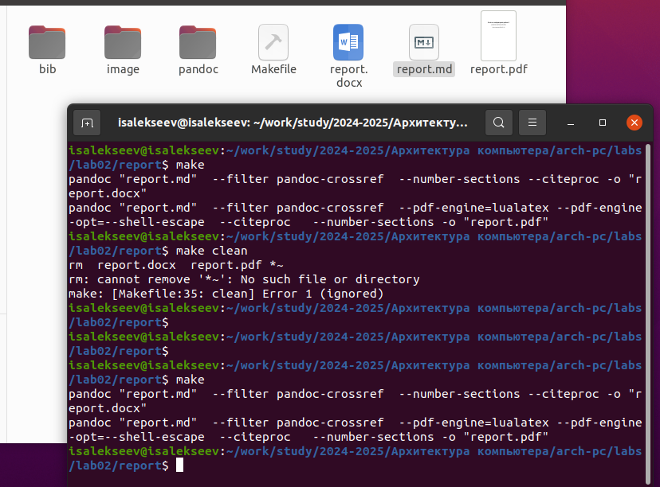

---
## Front matter
title: "Отчёт по лабораторной работе 3"
subtitle: "дисциплина:	Архитектура компьютера"
author: "Илья Алексеев НКА-02-24"

## Generic otions
lang: ru-RU
toc-title: "Содержание"

## Bibliography
bibliography: bib/cite.bib
csl: pandoc/csl/gost-r-7-0-5-2008-numeric.csl

## Pdf output format
toc: true # Table of contents
toc-depth: 2
lof: true # List of figures
lot: true # List of tables
fontsize: 12pt
linestretch: 1.5
papersize: a4
documentclass: scrreprt
## I18n polyglossia
polyglossia-lang:
  name: russian
  options:
	- spelling=modern
	- babelshorthands=true
polyglossia-otherlangs:
  name: english
## I18n babel
babel-lang: russian
babel-otherlangs: english
## Fonts
mainfont: PT Serif
romanfont: PT Serif
sansfont: PT Sans
monofont: PT Mono
mainfontoptions: Ligatures=TeX
romanfontoptions: Ligatures=TeX
sansfontoptions: Ligatures=TeX,Scale=MatchLowercase
monofontoptions: Scale=MatchLowercase,Scale=0.9
## Biblatex
biblatex: true
biblio-style: "gost-numeric"
biblatexoptions:
  - parentracker=true
  - backend=biber
  - hyperref=auto
  - language=auto
  - autolang=other*
  - citestyle=gost-numeric
## Pandoc-crossref LaTeX customization
figureTitle: "Рис."
tableTitle: "Таблица"
listingTitle: "Листинг"
lofTitle: "Список иллюстраций"
lotTitle: "Список таблиц"
lolTitle: "Листинги"
## Misc options
indent: true
header-includes:
  - \usepackage{indentfirst}
  - \usepackage{float} # keep figures where there are in the text
  - \floatplacement{figure}{H} # keep figures where there are in the text
---

# Цель работы

Целью работы является освоение процедуры оформления отчетов с помощью легковесного языка разметки Markdown.

# Задание

1. В соответствующем каталоге сделайте отчёт по лабораторной работе № 3 в формате Markdown. 
В качестве отчёта необходимо предоставить отчёты в 3 форматах: pdf, docx и md.

2. Загрузите файлы на github.

# Выполнение лабораторной работы

## Знакомство с Markdown

По инструкции лабораторной работы были установлены необходимые программы: pandoc и TexLive.

Открываю терминал и перехожу в каталог курса, который был создан при выполнении лабораторной работы №3. Для получения последних обновлений из удалённого репозитория, обновляю локальный репозиторий.

Затем перехожу в каталог с шаблоном отчёта по лабораторной работе №3.

Выполняю компиляцию шаблона с помощью Makefile. Ввожу команду make, и при успешной компиляции должны быть созданы файлы report.pdf и report.docx. Далее открываю их и проверяю, что файлы сгенерированы корректно. (рис. [-@fig:001], [-@fig:002], [-@fig:003])

{ #fig:001 width=70%, height=70% }

{ #fig:002 width=70%, height=70% }

{ #fig:003 width=70%, height=70% }

Удаляю сгенерированные файлы с помощью Makefile командой make clean. Проверяю, что файлы report.pdf и report.docx удалены успешно. (рис. [-@fig:004])

{ #fig:004 width=70%, height=70% }

Открываю файл report.md в текстовом редакторе, например, gedit. Внимательно изучаю его структуру, чтобы понимать, какие элементы необходимо изменить или дополнить. (рис. [-@fig:005])

{ #fig:005 width=70%, height=70% }

После заполнения отчета снова компилирую его с помощью Makefile. Проверяю корректность созданных файлов. (рис. [-@fig:006])

{ #fig:006 width=70%, height=70% }

Затем загружаю файлы в репозиторий на Github.

## Выполнение заданий для самостоятельной работы

В рамках самостоятельной работы подготовила отчет по лабораторной работе №2 и добавила его в репозиторий. (рис. [-@fig:007], [-@fig:008])

{ #fig:007 width=70%, height=70% }

{ #fig:008 width=70%, height=70% }

# Выводы

В ходе выполнения лабораторной работы я изучил синтаксис языка разметки Markdown, а также процесс создания отчета с использованием Makefile. Сгенерировал отчеты в форматах PDF и DOCX, проверил их корректность.
