---
## Front matter
title: "Отчёт по лабораторной работе 9"
subtitle: "дисциплина:	Архитектура компьютера"
author: "Илья Алексеев НКА-02-24"

## Generic otions
lang: ru-RU
toc-title: "Содержание"

## Bibliography
bibliography: bib/cite.bib
csl: pandoc/csl/gost-r-7-0-5-2008-numeric.csl

## Pdf output format
toc: true # Table of contents
toc-depth: 2
lof: true # List of figures
lot: true # List of tables
fontsize: 12pt
linestretch: 1.5
papersize: a4
documentclass: scrreprt
## I18n polyglossia
polyglossia-lang:
  name: russian
  options:
	- spelling=modern
	- babelshorthands=true
polyglossia-otherlangs:
  name: english
## I18n babel
babel-lang: russian
babel-otherlangs: english
## Fonts
mainfont: PT Serif
romanfont: PT Serif
sansfont: PT Sans
monofont: PT Mono
mainfontoptions: Ligatures=TeX
romanfontoptions: Ligatures=TeX
sansfontoptions: Ligatures=TeX,Scale=MatchLowercase
monofontoptions: Scale=MatchLowercase,Scale=0.9
## Biblatex
biblatex: true
biblio-style: "gost-numeric"
biblatexoptions:
  - parentracker=true
  - backend=biber
  - hyperref=auto
  - language=auto
  - autolang=other*
  - citestyle=gost-numeric
## Pandoc-crossref LaTeX customization
figureTitle: "Рис."
tableTitle: "Таблица"
listingTitle: "Листинг"
lofTitle: "Список иллюстраций"
lotTitle: "Список таблиц"
lolTitle: "Листинги"
## Misc options
indent: true
header-includes:
  - \usepackage{indentfirst}
  - \usepackage{float} # keep figures where there are in the text
  - \floatplacement{figure}{H} # keep figures where there are in the text
---

# Цель работы

Целью работы является приобретение навыков написания программ с использованием подпрограмм.
Знакомство с методами отладки при помощи GDB и его основными возможностями.

# Выполнение лабораторной работы

## Реализация подпрограмм в NASM

Сначала я создал новую папку для выполнения лабораторной работы №9 и перешел в нее. Затем создал файл с именем lab9-1.asm.

В качестве примера рассмотрел программу, которая вычисляет арифметическое выражение $f(x) = 2x + 7$ с использованием подпрограммы calcul. В этой программе значение переменной $x$ вводится с клавиатуры, а вычисление выражения осуществляется внутри подпрограммы. (рис. [-@fig:001], [-@fig:002])

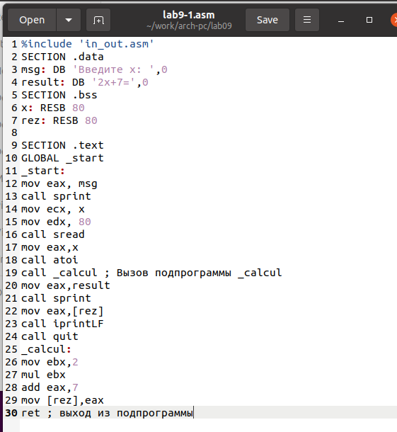{ #fig:001 width=70%, height=70% }

{ #fig:002 width=70%, height=70% }

После этого я модифицировал программу, добавив подпрограмму subcalcul внутри calcul. Это позволило вычислить составное выражение $f(g(x))$, где значение $x$ также вводится с клавиатуры. Определения функций: $f(x) = 2x + 7$, $g(x) = 3x - 1$. (рис. [-@fig:003], [-@fig:004])

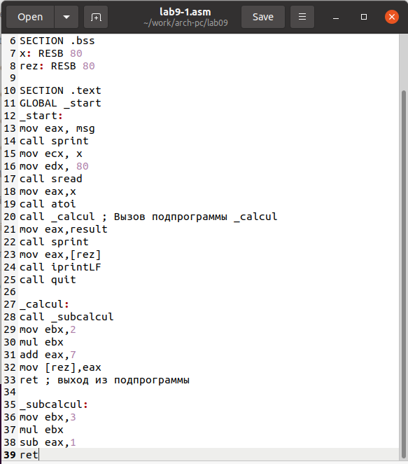{ #fig:003 width=70%, height=70% }

{ #fig:004 width=70%, height=70% }

## Отладка программы с помощью GDB

Создал файл lab9-2.asm, содержащий программу из Листинга 9.2, которая выводит сообщение "Hello world!" на экран. (рис. [-@fig:005])

{ #fig:005 width=70%, height=70% }

Скомпилировал файл и создал исполняемый файл, добавив ключ -g для включения отладочной информации. Загрузил исполняемый файл в отладчик GDB и запустил программу с помощью команды run. (рис. [-@fig:006])

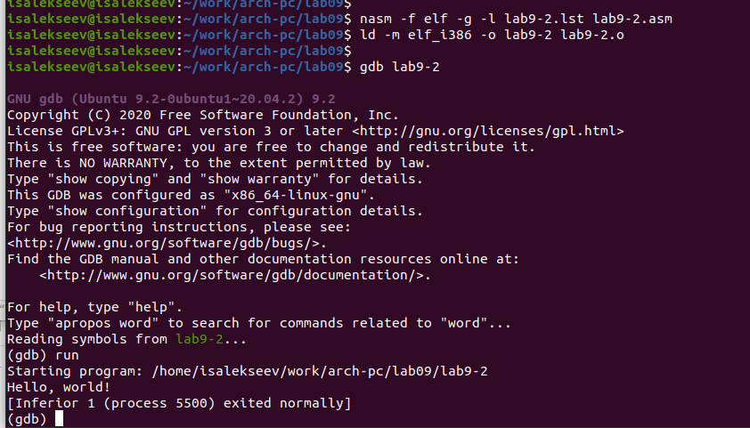{ #fig:006 width=70%, height=70% }

Для детального анализа установил точку остановки на метке _start и изучил дизассемблированный код программы. (рис. [-@fig:007], [-@fig:008])

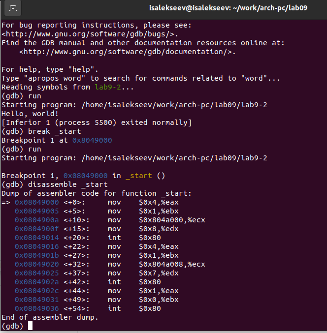{ #fig:007 width=70%, height=70% }

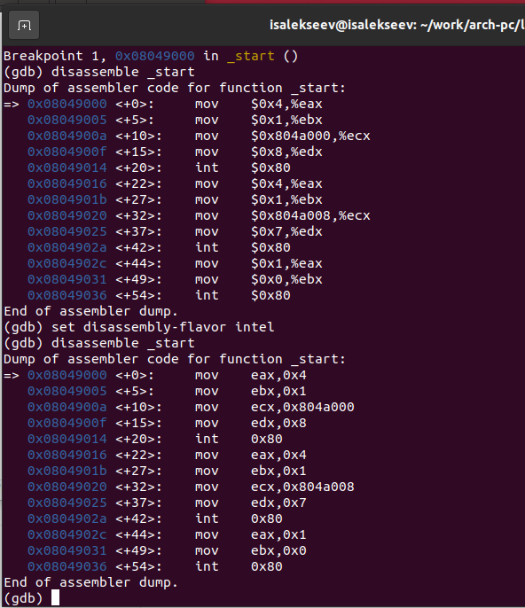{ #fig:008 width=70%, height=70% }

Установил точку останова по имени метки _start с помощью команды info breakpoints и добавил еще одну точку остановки по адресу предпоследней инструкции mov ebx, 0x0. (рис. [-@fig:009])

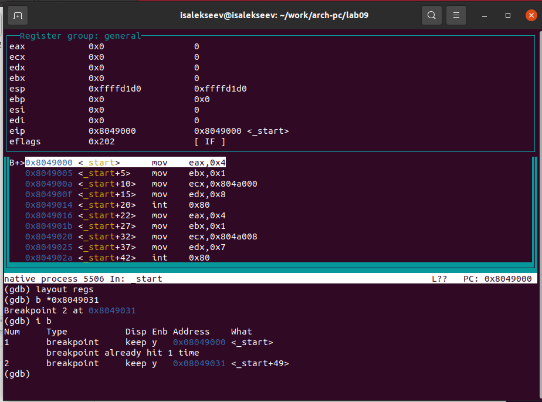{ #fig:009 width=70%, height=70% }

С помощью команды stepi выполнил пошаговое выполнение первых пяти инструкций, наблюдая за изменениями в регистрах. (рис. [-@fig:010], [-@fig:011])

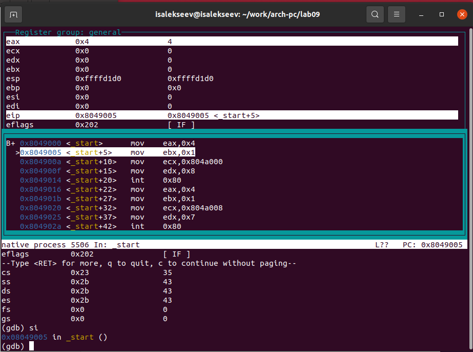{ #fig:010 width=70%, height=70% }

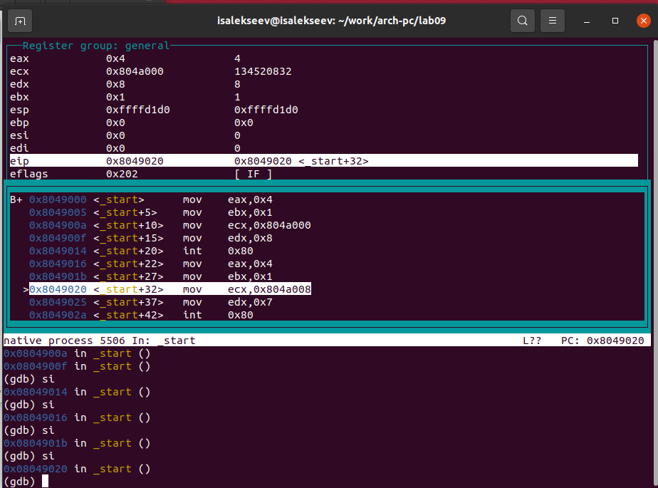{ #fig:011 width=70%, height=70% }

Для анализа переменных использовал команду set, изменив первый символ переменной msg1. (рис. [-@fig:012], [-@fig:013])

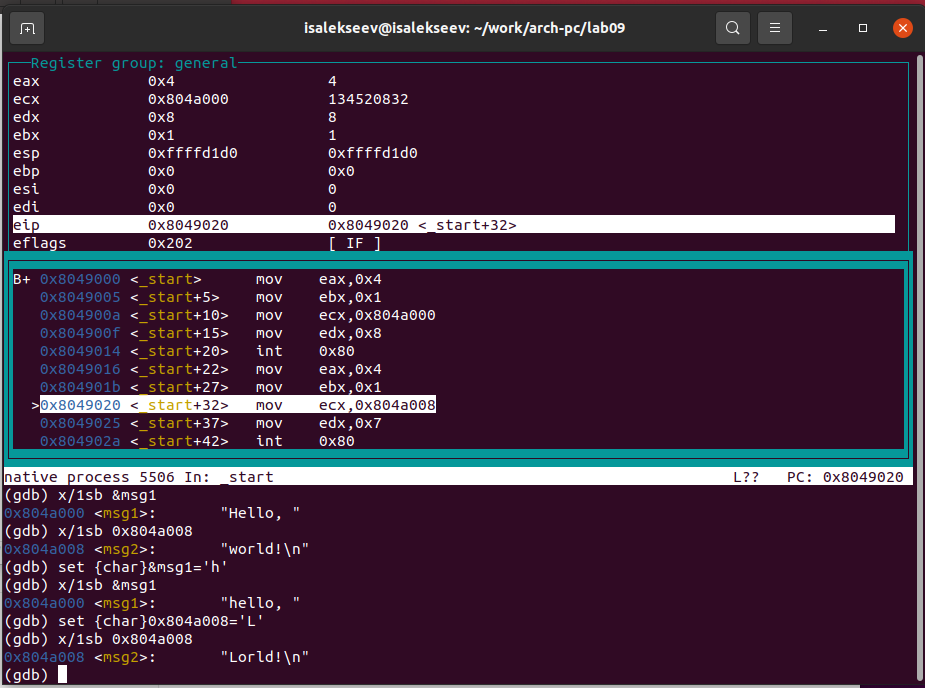{ #fig:012 width=70%, height=70% }

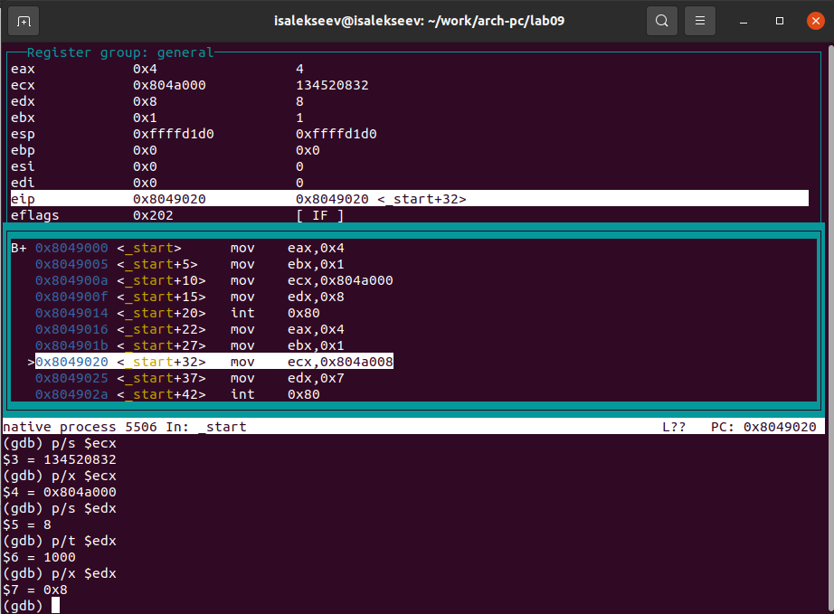{ #fig:013 width=70%, height=70% }

Также изменил значение регистра ebx на нужное. (рис. [-@fig:014])

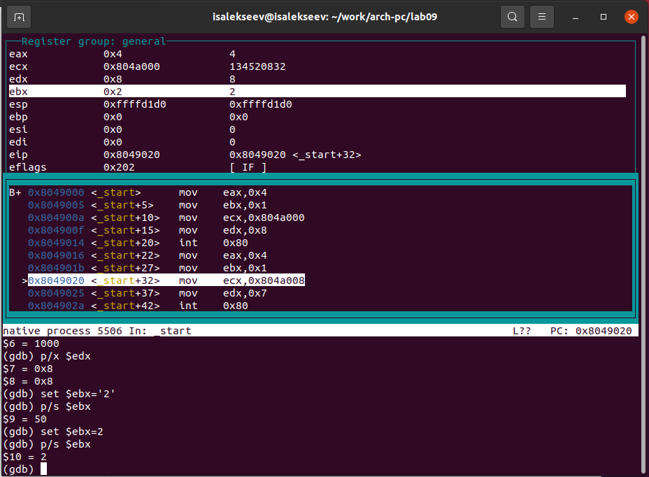{ #fig:014 width=70%, height=70% }

Скопировал файл lab8-2.asm из лабораторной работы №8 и создал исполняемый файл. Использовал ключ --args для передачи аргументов в программу при запуске через GDB. Исследовал содержимое стека, где в esp находится количество аргументов, а остальные позиции содержат указатели на строки. (рис. [-@fig:015])

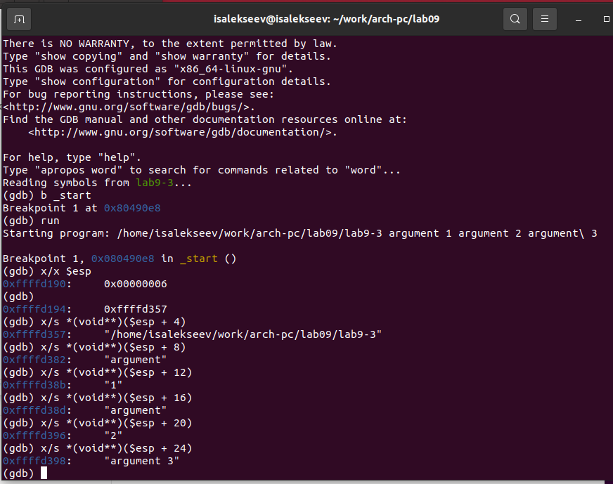{ #fig:015 width=70%, height=70% }

## Задание для самостоятельной работы

Преобразовал программу из лабораторной работы №8, добавив вычисление функции $f(x)$ в виде подпрограммы. (рис. [-@fig:016], [-@fig:017])

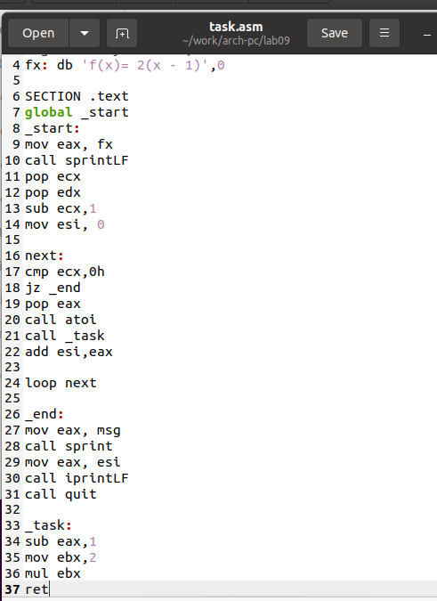{ #fig:016 width=70%, height=70% }

{ #fig:017 width=70%, height=70% }

В процессе анализа обнаружил ошибки: перепутан порядок аргументов у инструкции add и отправка ebx вместо eax в конце. Исправил ошибки. (рис. [-@fig:018], [-@fig:020])

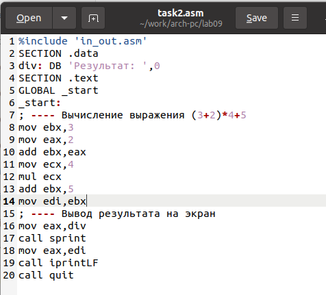{ #fig:018 width=70%, height=70% }

{ #fig:020 width=70%, height=70% }

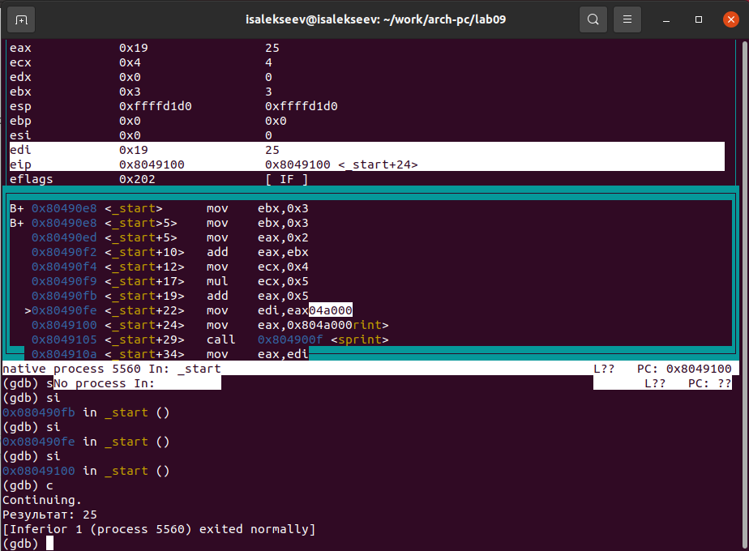{ #fig:021 width=70%, height=70% }

# Выводы

В ходе лабораторной работы освоил работу с подпрограммами на NASM и изучил методы отладки с использованием GDB.
